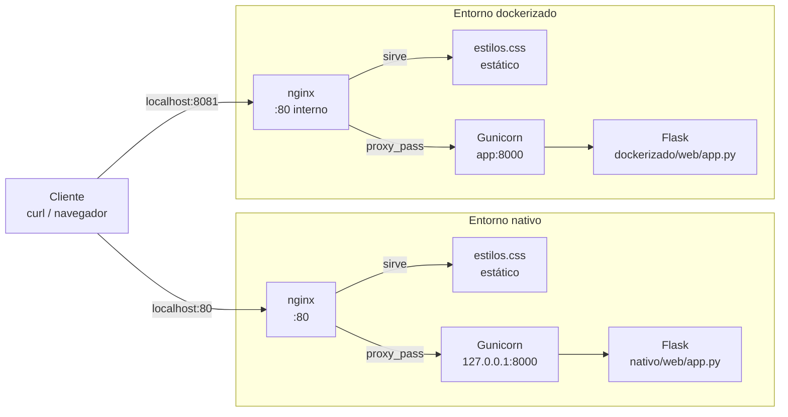

# Tarea AE2 — Calculadora Web con nginx + Gunicorn

## Stack elegido

Se ha elegido el stack Python:

-   Flask como framework de la aplicación.
-   Gunicorn como servidor de aplicaciones WSGI.
-   nginx como servidor web y proxy inverso.
-   Docker Compose para el entorno dockerizado.

## Índice

- [1. Instalación](#1-instalación)
- [2. Crear la calculadora Flask](#2-crear-la-calculadora-flask)
- [3. Publicar los estáticos en el DocumentRoot](#3-publicar-los-estáticos-en-el-documentroot)
- [4. Iniciar Gunicorn en foreground](#4-iniciar-gunicorn-en-foreground)
- [5. Crear el server block de nginx](#5-crear-el-server-block-de-nginx)
- [6. Activar, validar y recargar nginx](#6-activar-validar-y-recargar-nginx)
- [7. Comprobar el entorno nativo y leer los logs](#7-comprobar-el-entorno-nativo-y-leer-los-logs)
- [8. Crear el entorno dockerizado con Docker Compose](#8-crear-el-entorno-dockerizado-con-docker-compose)
- [9. Comprobación](#9-comprobación)
- [10. Repositorio remoto](#10-repositorio-remoto)

## 1. Instalación

### Entorno nativo

La práctica se realiza dentro del contenedor de laboratorio `dpl-lab`, basado en Ubuntu.

Antes de instalar los servicios, se configuró `policy-rc.d` para evitar que los paquetes intentasen arrancar servicios automáticamente mediante `systemd` ya que el contenedor no lo utiliza.

```bash
docker exec dpl-lab bash -c 'printf "#!/bin/sh\\nexit 101\\n" > /usr/sbin/policy-rc.d && chmod +x /usr/sbin/policy-rc.d'  
```
Se actualizaron los repositorios e instalaron Python, el módulo para entornos virtuales, nginx y curl:

```bash
docker exec dpl-lab apt-get update  
docker exec dpl-lab apt-get install -y python3 python3-venv nginx curl  
```
Versiones comprobadas:

```bash
Python 3.12.3  
nginx version: nginx/1.24.0 (Ubuntu)  
curl 8.5.0  
```

El proyecto se encuentra en:

```bash
/home/aperez/dpl/ae2  
```

### Entorno virtual y dependencias

La aplicación utiliza un entorno virtual de Python para mantener aisladas sus dependencias. Esto también evita el problema `externally-managed-environment` asociado a las instalaciones de paquetes Python en el sistema.

El fichero `nativo/web/requirements.txt` contiene:

```bash
flask==3.1.0  
gunicorn==23.0.0  
```

El entorno virtual se creó en la raíz del microproyecto:

```bash
docker exec dpl-lab bash -c 'cd /home/aperez/dpl/ae2 && python3 -m venv .venv'  
```

Las dependencias se instalaron utilizando el `pip` del entorno virtual:

```bash
docker exec dpl-lab bash -c 'cd /home/aperez/dpl/ae2 && .venv/bin/pip install -r nativo/web/requirements.txt'  
```

La instalación se comprobó con:

```bash
docker exec dpl-lab bash -c 'cd /home/aperez/dpl/ae2 && .venv/bin/pip list | grep -iE "flask|gunicorn"'  

Flask        3.1.0
gunicorn     23.0.0
```

El entorno virtual `.venv/` no se versiona mediante Git porque contiene dependencias instaladas y puede regenerarse a partir de `requirements.txt`.

### Arquitectura



## 2. Crear la calculadora Flask

La aplicación web se implementa con Flask y realiza los cálculos en el servidor mediante Python. No se utiliza JavaScript para realizar las operaciones.

La aplicación principal se encuentra en:

```bash
nativo/web/app.py
```

El fichero contiene las operaciones de suma, resta, multiplicación y división, además de la validación de los operandos y la comprobación de división entre cero.

La aplicación dispone de una ruta GET para mostrar el formulario y una ruta POST para procesar los datos enviados por el usuario.

La plantilla HTML se encuentra en:

```bash
nativo/web/templates/index.html
```
La plantilla contiene el formulario de la calculadora y muestra el resultado del cálculo o el mensaje de error correspondiente.

El título utilizado para identificar el entorno nativo es `Calculadora en entorno nativo`

Los estilos de la aplicación se encuentran en:

```bash
nativo/web/estilos.css
```

Los archivos creados se comprobaron con:

```bash
ls -l nativo/web/app.py
ls -l nativo/web/estilos.css
ls -l nativo/web/templates/index.html
```

Los tres archivos existen correctamente y quedan preparados para ejecutar la aplicación mediante Gunicorn y publicarla posteriormente a través de nginx.

## 3. Publicar los estáticos en el DocumentRoot

El fichero CSS de la aplicación se sirve mediante nginx como contenido estático.

Se creó el DocumentRoot de la aplicación dentro del contenedor:

```bash
docker exec dpl-lab mkdir -p /var/www/calculadora
```

Después se copió el fichero de estilos desde el microproyecto:

```bash
docker exec dpl-lab bash -c 'cp /home/aperez/dpl/ae2/nativo/web/estilos.css /var/www/calculadora/'
```

Se comprobó que el fichero se había copiado correctamente:

```bash
docker exec dpl-lab ls -la /var/www/calculadora/
```
El resultado obtenido fue:

`estilos.css`

Finalmente se establecieron permisos de lectura y acceso para que nginx pueda servir el fichero:

```bash
docker exec dpl-lab chmod -R a+rX /var/www/calculadora
```
Se comprobó que el fichero mantiene permisos de lectura:

```bash
-rw-r--r-- 1 root root 1146 Oct  4 17:44 /var/www/calculadora/estilos.css
```

El fichero queda publicado en `/var/www/calculadora/estilos.css`

El código Python no se copia al DocumentRoot. La aplicación Flask se ejecutará posteriormente mediante Gunicorn desde el microproyecto.

## 4. Iniciar Gunicorn en foreground 

La aplicación Flask se ejecuta mediante Gunicorn. Como el contenedor `dpl-lab` no utiliza `systemd`, Gunicorn se inicia mediante `docker exec -d`.

Se inició Gunicorn desde el directorio que contiene `app.py`:

```bash
docker exec -d dpl-lab bash -c 'cd /home/aperez/dpl/ae2/nativo/web && /home/aperez/dpl/ae2/.venv/bin/gunicorn --bind 127.0.0.1:8000 --workers 2 --access-logfile - --error-logfile - app:app > /var/log/calculadora-gunicorn.log 2>&1'
```

Se comprobaron los procesos de Gunicorn:

```bash
docker exec dpl-lab ps aux | grep gunicorn
```

Salida:

```bash
root         675  0.0  0.0   4336  3396 ?        Ss   18:49   0:00 bash -c cd /home/aperez/dpl/ae2/nativo/web && /home/aperez/dpl/ae2/.venv/bin/gunicorn --bind 127.0.0.1:8000 --workers 2 --access-logfile - --error-logfile - app:app > /var/log/calculadora-gunicorn.log 2>&1
root         682  0.0  0.1  31288 24312 ?        S    18:49   0:00 /home/aperez/dpl/ae2/.venv/bin/python3 /home/aperez/dpl/ae2/.venv/bin/gunicorn --bind 127.0.0.1:8000 --workers 2 --access-logfile - --error-logfile - app:app
root         683  0.0  0.1  39064 29732 ?        S    18:50   0:00 /home/aperez/dpl/ae2/.venv/bin/python3 /home/aperez/dpl/ae2/.venv/bin/gunicorn --bind 127.0.0.1:8000 --workers 2 --access-logfile - --error-logfile - app:app
root         684  0.0  0.1  39136 29716 ?        S    18:50   0:00 /home/aperez/dpl/ae2/.venv/bin/python3 /home/aperez/dpl/ae2/.venv/bin/gunicorn --bind 127.0.0.1:8000 --workers 2 --access-logfile - --error-logfile - app:app
```

Se comprobó que Gunicorn responde directamente en el puerto 8000 mediante `curl`:

```bash
docker exec dpl-lab curl -I http://127.0.0.1:8000/
```

Salida:

```bash
  % Total    % Received % Xferd  Average Speed   Time    Time     Time  Current
                                 Dload  Upload   Total   Spent    Left  Speed
  0     0    0     0    0     0      0      0 --:--:-- --:--:-- --:--:--     0HTTP/1.1 200 OK
Server: gunicorn
Date: Sun, 04 Oct 2026 18:52:24 GMT
Connection: close
Content-Type: text/html; charset=utf-8
Content-Length: 1070

  0  1070    0     0    0     0      0      0 --:--:-- --:--:-- --:--:--     0
```

Finalmente se revisaron los registros de Gunicorn:

```bash
docker exec dpl-lab tail -n 5 /var/log/calculadora-gunicorn.log

[2026-10-04 18:50:00 +0000] [682] [INFO] Listening at: http://127.0.0.1:8000 (682)
[2026-10-04 18:50:00 +0000] [682] [INFO] Using worker: sync
[2026-10-04 18:50:00 +0000] [683] [INFO] Booting worker with pid: 683
[2026-10-04 18:50:00 +0000] [684] [INFO] Booting worker with pid: 684
127.0.0.1 - - [04/Oct/2026:18:52:24 +0000] "HEAD / HTTP/1.1" 200 0 "-" "curl/8.5.0"
```

## 5. Crear el server block de nginx

Se creó el server block de nginx para la aplicación en:

```bash
/etc/nginx/sites-available/calculadora
```

El fichero se creó manualmente con privilegios de root dentro del contenedor:

```bash
docker exec -it dpl-lab bash
nano /etc/nginx/sites-available/calculadora
```

La configuración creada es:

```bash
server {
    listen 80 default_server;
    listen [::]:80 default_server;
    server_name _;
    root /var/www/calculadora;

    location = /estilos.css {
        try_files \$uri =404;
    }

    location / {
        proxy_pass http://127.0.0.1:8000;
        proxy_set_header Host \$host;
        proxy_set_header X-Real-IP \$remote_addr;
        proxy_set_header X-Forwarded-For \$proxy_add_x_forwarded_for;
        proxy_set_header X-Forwarded-Proto \$scheme;
    }

    access_log /var/log/nginx/calculadora.access.log;
    error_log /var/log/nginx/calculadora.error.log;
}
```

El `DocumentRoot` utilizado por nginx es `/var/www/calculadora`, donde se encuentra el fichero estático `estilos.css`.

La ruta `/estilos.css` se sirve directamente mediante nginx:

```bash
location = /estilos.css {
    try_files $uri =404;
}
```

El resto de las peticiones se envían mediante `proxy_pass` al servidor Gunicorn que está escuchando en `127.0.0.1:8000`. Las cabeceras también fueron configuradas:

```bash
location / {  
        proxy\_pass http://127.0.0.1:8000;  
        proxy\_set\_header Host $host;  
        proxy\_set\_header X-Real-IP $remote\_addr;  
        proxy\_set\_header X-Forwarded-For $proxy\_add\_x\_forwarded\_for;  
        proxy\_set\_header X-Forwarded-Proto $scheme;  
    }
```

Los logs específicos de la aplicación se configuraron en:

```bash
/var/log/nginx/calculadora.access.log
/var/log/nginx/calculadora.error.log
```

## 6. Activar, validar y recargar nginx

Una vez creado el `server block`, se desactivó el sitio por defecto de nginx para evitar conflictos con `default_server`:

```bash
docker exec dpl-lab rm -f /etc/nginx/sites-enabled/default
```

Se activó el sitio `calculadora` mediante un enlace simbólico desde `sites-available` a `sites-enabled`:

```bash
docker exec dpl-lab ln -sf /etc/nginx/sites-available/calculadora /etc/nginx/sites-enabled/calculadora
```

Se comprobó que el enlace simbólico se había creado correctamente:

```bash
docker exec dpl-lab ls -la /etc/nginx/sites-enabled
```

Resultado:

```text
calculadora -> /etc/nginx/sites-available/calculadora
```

Antes de arrancar nginx se validó la configuración:

```bash
docker exec dpl-lab nginx -t
```

Resultado:

```text
nginx: the configuration file /etc/nginx/nginx.conf syntax is ok
nginx: configuration file /etc/nginx/nginx.conf test is successful
```

Como nginx no estaba iniciado previamente en el contenedor, se arrancó mediante:

```bash
docker exec dpl-lab nginx
```

Después se comprobó que el proceso maestro y los workers estaban funcionando:

```bash
docker exec dpl-lab ps aux | grep nginx
```

```text
root         785  0.0  0.0  11296  3672 ?        Ss   19:53   0:00 nginx: master process nginx
www-data     803  0.0  0.0  11480  3316 ?        S    19:54   0:00 nginx: worker process
www-data     804  0.0  0.0  11480  3316 ?        S    19:54   0:00 nginx: worker process
www-data     805  0.0  0.0  11480  3316 ?        S    19:54   0:00 nginx: worker process
www-data     806  0.0  0.0  11480  3316 ?        S    19:54   0:00 nginx: worker process
www-data     807  0.0  0.0  11480  3316 ?        S    19:54   0:00 nginx: worker process
```

Se comprobó el acceso a la aplicación a través de nginx:

```bash
docker exec dpl-lab curl -I localhost
```

Resultado:

```text
HTTP/1.1 200 OK
Server: nginx/1.24.0 (Ubuntu)
Content-Type: text/html; charset=utf-8
```

Finalmente, se comprobó que nginx puede recargar correctamente su configuración:

```bash
docker exec dpl-lab nginx -s reload
```

Resultado:

```text
2026/10/04 19:54:22 [notice] 797#797: signal process started
```

Está activo el `server block` de `calculadora` y nginx recibe las peticiones en el puerto 80, sirviendo directamente los archivos estáticos y enviando las peticiones de la aplicación a Gunicorn mediante `proxy_pass`.

## 7. Comprobar el entorno nativo y leer los logs

Una vez iniciado nginx y configurado el server block, se comprobó el funcionamiento de la aplicación tanto desde dentro del contenedor como desde el host.

### Comprobaciones desde el contenedor

Se comprobó que nginx respondía correctamente:

```bash
docker exec dpl-lab curl -I localhost  
```

Resultado:

```text
HTTP/1.1 200 OK  
Server: nginx/1.24.0 (Ubuntu)  
```

Se comprobó que la página mostraba el título correspondiente al entorno nativo:

```bash
docker exec dpl-lab curl -s localhost | grep -o "<h1>.\*</h1>"  
```
Resultado:

```text
<h1>Calculadora en entorno nativo</h1>  
```
Se comprobó el cálculo de una suma:

```bash
docker exec dpl-lab curl -s -d "v1=7&v2=5&op=%2B" http://localhost/ | grep -i "Resultado"  
```
Resultado:

```text
<p class="resultado">Resultado: 12</p>  
```
También se comprobó una multiplicación:

```bash
docker exec dpl-lab curl -s -d "v1=6&v2=7&op=\*" http://localhost/ | grep -i "Resultado"  
```

Resultado:

```text
<p class="resultado">Resultado: 42</p>  
```

Finalmente se comprobó que nginx sirve correctamente el fichero estático:

```bash
docker exec dpl-lab curl -s -o /dev/null -w "%{http\_code}\\n" http://localhost/estilos.css  
```

Resultado:
```text
200  
```
### Comprobaciones desde el anfitrión

También se comprobó el acceso a la aplicación desde la máquina anfitriona:

```bash
curl -I localhost 
```

Resultado:

```text
HTTP/1.1 200 OK  
Server: nginx/1.24.0 (Ubuntu)  
```

Se comprobó nuevamente el cálculo desde el anfitrión:

```bash
curl -s -d "v1=6&v2=7&op=\*" http://localhost/ | grep -i "Resultado"  
```
Resultado:
```text
<p class="resultado">Resultado: 42</p>  
```

Esto demuestra que la petición atraviesa nginx, llega a Gunicorn y finalmente es procesada por la aplicación Flask.

### Logs de nginx

Se revisaron los últimos registros de acceso de nginx:

```bash
docker exec dpl-lab tail -n 5 /var/log/nginx/calculadora.access.log  
```

Se observaron peticiones `GET`, `POST` y `HEAD` con código HTTP `200`, incluyendo la petición al fichero `estilos.css`.

```text
::1 - - [04/Oct/2026:20:16:15 +0000] "POST / HTTP/1.1" 200 1074 "-" "curl/8.5.0"
::1 - - [04/Oct/2026:20:17:57 +0000] "POST / HTTP/1.1" 200 1074 "-" "curl/8.5.0"
::1 - - [04/Oct/2026:20:19:40 +0000] "GET /estilos.css HTTP/1.1" 200 1146 "-" "curl/8.5.0"
172.17.0.1 - - [04/Oct/2026:20:20:00 +0000] "HEAD / HTTP/1.1" 200 0 "-" "curl/8.5.0"
172.17.0.1 - - [04/Oct/2026:20:20:20 +0000] "POST / HTTP/1.1" 200 1074 "-" "curl/8.5.0"
```

### Logs de Gunicorn

También se revisaron los registros de Gunicorn:

```bash
docker exec dpl-lab tail -n 5 /var/log/calculadora-gunicorn.log  
```
Los registros muestran las peticiones recibidas por Gunicorn, incluyendo las peticiones `POST /` utilizadas para realizar los cálculos.

```text
127.0.0.1 - - [04/Oct/2026:20:12:45 +0000] "GET / HTTP/1.0" 200 1070 "-" "curl/8.5.0"
127.0.0.1 - - [04/Oct/2026:20:16:15 +0000] "POST / HTTP/1.0" 200 1074 "-" "curl/8.5.0"
127.0.0.1 - - [04/Oct/2026:20:17:57 +0000] "POST / HTTP/1.0" 200 1074 "-" "curl/8.5.0"
127.0.0.1 - - [04/Oct/2026:20:20:00 +0000] "HEAD / HTTP/1.0" 200 0 "-" "curl/8.5.0"
127.0.0.1 - - [04/Oct/2026:20:20:20 +0000] "POST / HTTP/1.0" 200 1074 "-" "curl/8.5.0"
```

### Copia del server block

Antes de versionar la configuración, se realizó una copia del server block dentro del proyecto:

```bash
docker cp dpl-lab:/etc/nginx/sites-available/calculadora ~/dpl/ae2/nativo/nginx-calculadora.conf  
```

La copia queda almacenada en:

```text
nativo/nginx-calculadora.conf  
```

## 8. Crear el entorno dockerizado con Docker Compose

Se creó un entorno dockerizado equivalente al entorno nativo. La estructura creada es:

```text  
dockerizado/  
├── compose.yml  
├── nginx/  
│   └── default.conf  
└── web/  
    ├── app.py  
    ├── estilos.css  
    ├── requirements.txt  
    └── templates/  
        └── index.html  
```

La aplicación del entorno nativo se copió al directorio `dockerizado/web`:

```bash
cp -r nativo/web dockerizado/
```
Después se modificó el título de la página para identificar el entorno dockerizado:

```text
<title>Calculadora en entorno dockerizado</title>  
<h1>Calculadora en entorno dockerizado</h1>
```

Se eliminó el directorio `__pycache__`, ya que contiene ficheros generados automáticamente por Python y no forma parte del código de la aplicación:

```bash
rm -rf dockerizado/web/__pycache__  
```

### Configuración de Docker Compose

El fichero `dockerizado/compose.yml` define los servicios `app` y `web`.

El servicio `app` utiliza la imagen oficial `python:3.12-slim`. El código de la aplicación se monta como volumen de solo lectura en `/srv/app`. Al arrancar el contenedor se instalan las dependencias indicadas en `requirements.txt` y se inicia Gunicorn escuchando en todas las interfaces del contenedor en el puerto `8000`:

```text
services:  
  app:  
    image: python:3.12-slim  
    working\_dir: /srv/app  
    volumes:  
      - ./web:/srv/app:ro  
    command: >  
      sh -c "pip install --no-cache-dir -r requirements.txt &&  
             gunicorn --bind 0.0.0.0:8000 --workers 2 --access-logfile - --error-logfile - app:app"  
```

El servicio `web` utiliza nginx y monta la configuración del proxy inverso desde `dockerizado/nginx/default.conf`. También monta el directorio de la aplicación como contenido estático:

```text
  web:  
    image: nginx:1.27  
    volumes:  
      - ./nginx/default.conf:/etc/nginx/conf.d/default.conf:ro  
      - ./web:/usr/share/nginx/html:ro  
    ports:  
      - "8081:80"  
    depends\_on:  
      - app  
```

Inicialmente se configuró el puerto externo `8080`, pero este puerto ya estaba ocupado por el contenedor `dpl-lab`:

```text
Error response from daemon: failed to set up container networking:  
Bind for 0.0.0.0:8080 failed: port is already allocated  
```

Se comprobó la ocupación del puerto mediante:

```bash
docker ps  
```

El contenedor `dpl-lab` ya tenía publicado el puerto `8080`, por lo que se modificó el `compose.yml` para utilizar el puerto `8081` del anfitrión:

```text
ports:  
  - "8081:80"  
```
Después se detuvieron los servicios creados parcialmente:

```bash
docker compose down  
```
y se volvieron a iniciar:

```bash
docker compose up -d  
```
Los dos servicios quedaron funcionando correctamente:

```bash
docker compose ps  
```
Salida:

```text
NAME                IMAGE              COMMAND                  SERVICE   CREATED          STATUS          PORTS  
dockerizado-app-1   python:3.12-slim   "sh -c 'pip install …"   app       ...              Up  
dockerizado-web-1   nginx:1.27         "/docker-entrypoint.…"   web       ...              Up        0.0.0.0:8081->80/tcp  
```
### Comprobación de la aplicación

Se comprobó que nginx responde correctamente mediante el puerto `8081`:

```bash
curl -I localhost:8081  
```
Resultado:

```text
HTTP/1.1 200 OK  
Server: nginx/1.27.5  
Date: Sun, 04 Oct 2026 21:14:33 GMT  
Content-Type: text/html; charset=utf-8  
Content-Length: 1080  
Connection: keep-alive  
```

También se comprobó que se está sirviendo la versión dockerizada de la página y probamos una suma:

```bash
curl -s http://localhost:8081/ | grep -o "<h1>.\*</h1>"  
curl -s -d "v1=7&v2=5&op=%2B" http://localhost:8081/ | grep -i "Resultado"  
```

Finalmente se revisaron los logs del servicio de aplicación:

```bash
docker compose logs --tail=10 app  
```

Los registros muestran que Gunicorn se inició correctamente, escuchando en `0.0.0.0:8000`, con dos workers:

```text
\[INFO\] Starting gunicorn 23.0.0  
\[INFO\] Listening at: http://0.0.0.0:8000 (10)  
\[INFO\] Using worker: sync  
\[INFO\] Booting worker with pid: 11  
\[INFO\] Booting worker with pid: 12  
```
También aparecen las peticiones realizadas a través de nginx:

```text
"HEAD / HTTP/1.0" 200  
"GET / HTTP/1.0" 200  
"POST / HTTP/1.0" 200  
```

Esto confirma que el flujo completo funciona correctamente. El entorno dockerizado queda accesible desde el anfitrión mediante:

```text
http://localhost:8081/
```

## 9. Comprobación

Se verificaron los dos entornos mediante curl, comprobando tanto el h1 exigido como el cálculo realizado por la aplicación.

### Entorno nativo

```bash
docker exec dpl-lab nginx -T | grep -E "server_name|root|proxy_pass"
docker exec dpl-lab ps aux | grep gunicorn
docker exec dpl-lab curl -s http://localhost/ | grep "Calculadora en entorno nativo"
docker exec dpl-lab curl -s -d "v1=6&v2=7&op=*" http://localhost/ | grep -i "Resultado"
```

### Entorno dockerizado

```bash
cd dockerizado
docker compose up -d && docker compose ps
curl -s http://localhost:8081/ | grep "Calculadora en entorno dockerizado"
curl -s -d "v1=6&v2=7&op=*" http://localhost:8081/ | grep -i "Resultado"
docker compose down
```

Las salidas reales de estas comprobaciones se conservan en `comprobaciones.txt`.

## 10. Repositorio remoto

El proyecto se encuentra versionado localmente mediante Git y se ha asociado a un repositorio remoto en GitHub:

```text
git@github.com:apg-29/Calculadora-Web.git
```
